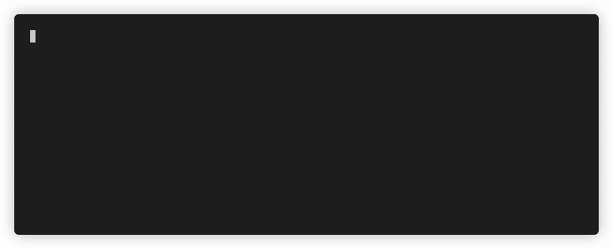

# Demo RAG application

In this guide, we will set up a simple Qdrant cluster along with a demo application that allows uploading PDF documents to the database and answering questions about their content. 
The main advantage is that the demo application does not rely on paid APIs from well-known services (such as Google Vertex AI or OpenAI). 
We will use the following models to work with the data:

- `Xenova/all-MiniLM-L6-v2` for embedding document chunks.
- `Xenova/distilbert-base-cased-distilled-squad` for answering questions based on the provided context.

Qdrant will store the vectorized data and perform semantic searches for the relevant context using user-generated queries.

1. Deploy a minimal Qdrant cluster:

```bash
kubectl apply -f https://raw.githubusercontent.com/ganochenkodg/qdrant-operator/main/examples/qdrant-cluster-minimal.yaml
```

2. Start the pod with the demo app, which requires a minimum of 1 CPU and 2 GB of memory for execution:

```bash
kubectl apply -f https://raw.githubusercontent.com/ganochenkodg/qdrant-operator/main/demo-app/demo-app.yaml
```

3. Wait for its readiness and connect:

```bash
kubectl wait pods demo-app --for condition=Ready --timeout=300s
kubectl exec -it demo-app -- sh
```

4. This pod contains two prepared PDF documents in the `pdfs` folder:

- `carbon-free-energy.pdf` with the Google report about renewable sources of energy, 2023 year
- `cost-of-living.pdf` with the cost of living report for EU countries, 2022 year 

Run the demo app, passing the first document as an argument

```bash
node index.js pdfs/carbon-free-energy.pdf
```

After preparing the data you will see greeting from the bot and can ask your questions. Press `CTRL-C` to exit the app.



Run the app, choosing the second document:

```bash
node index.js pdfs/cost-of-living.pdf
```


Feel free to use the code of this program as a starting point for your projects utilizing Qdrant as a storage solution and flexible search engine.

### Code explanation

Import all required modules:

```js
import readline from 'readline-sync';
import { PDFLoader } from 'langchain/document_loaders/fs/pdf';
import { RecursiveCharacterTextSplitter } from 'langchain/text_splitter';
import { HuggingFaceTransformersEmbeddings } from '@langchain/community/embeddings/hf_transformers';
import { QdrantVectorStore } from '@langchain/community/vectorstores/qdrant';
import { pipeline } from '@xenova/transformers';
```

Define the function for capitalizing the beginning of sentences:

```js
const capitalizeFirstLetter = (string) => {
  return string.charAt(0).toUpperCase() + string.slice(1);
};
```

Read the file name from application arguments, define the PDF loader and text splitter. Recursive splitter will try to preserve text paragraphs.

```js
const filename = process.argv[2];
const loader = new PDFLoader(filename, {
  splitPages: false
});
const textSplitter = new RecursiveCharacterTextSplitter({
  chunkSize: 1500,
  chunkOverlap: 0
});
```

Configure embedding and QA models:

```js
console.log('Initializing required models...');
const embeddings = new HuggingFaceTransformersEmbeddings({
  modelName: 'Xenova/all-MiniLM-L6-v2'
});
const answerer = await pipeline(
  'question-answering',
  'Xenova/distilbert-base-cased-distilled-squad'
);
```

Load the document:

```js
console.log(`Demo application started! Loading ${filename}...`);
const docs = await loader.load();
```

Split it into the smaller chunks:

```js
console.log(`Splitting ${filename} into chunks...`);
const splitDocs = await textSplitter.splitDocuments(docs);
```

Vectorize and upload the to Qdrant:

```js
console.log(`Uploading documents to Qdrant...`);
const index = await QdrantVectorStore.fromDocuments(splitDocs, embeddings, {
  url: process.env.QDRANT_URL,
  collectionName: 'qa-docs'
});
```

Write the welcome phrase and read user input in infinity loop:

```js
console.log('\x1b[36mBot:\x1b[0m Hello! How can I help you?');
while (true) {
  let query = readline.question('\x1b[33mUser:\x1b[0m ');
```

Define the connection to the collection and find the most relevant part of the document:

```js
  const client = await QdrantVectorStore.fromExistingCollection(embeddings, {
    url: process.env.QDRANT_URL,
    collectionName: 'qa-docs'
  });
  let response = await client.similaritySearch(query, 1);
```

Pass the user query and the context to QA model and return an answer:

```js
  let output = await answerer(query, response[0].pageContent);
  console.log(`\x1b[36mBot:\x1b[0m ${capitalizeFirstLetter(output.answer)}`);
}
```
